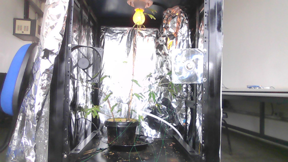
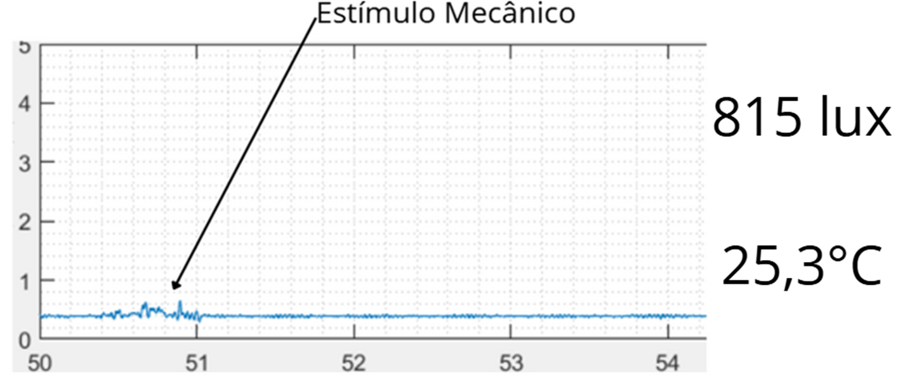
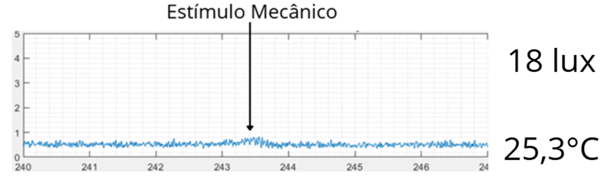
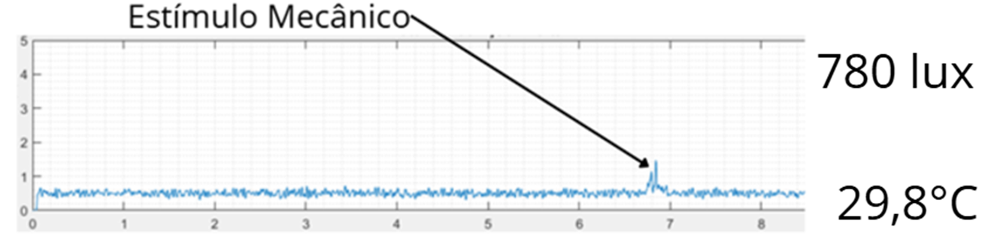

# Estufa Automatizada para Estudos de Potenciais Elétricos em Plantas

# 1.Descrição do Projeto

Este projeto visa a criação de uma estufa automatizada para estudar potenciais bioelétricos em plantas, como os Potenciais de Ação (PAs) e Potenciais de Variação (PVs), sob condições ambientais controladas.

A estufa foi desenvolvida a partir de materiais reciclados (como um rack de servidor) e equipada com sensores e atuadores controlados por microcontroladores Arduino. Ela possibilita o controle e a medição de variáveis ambientais como:
Luminosidade
Temperatura
Umidade do solo 

Além disso, um sistema de aquisição de dados monitora sinais bioelétricos em tempo real, possibilitando análises detalhadas das interações planta-ambiente.

# 2.Tecnologias Utilizadas

Hardware:
Arduino Uno R3 e Arduino Nano
Amplificador EI-1040

Sensores:
LDR para medição de luminosidade
DHT11 para umidade e temperatura
Higrômetro para umidade do solo

Atuadores:
Coolers para ventilação
Lâmpada incandescente para ajuste de luz
Bomba d’água para irrigação

Software:
C++ (Arduino IDE)
Python para processamento de dados
Flask para a criação de APIs
HTML/CSS/JavaScript para interface web

# 3.Instalação e Configuração

Clone o repositório do projeto:
git clone https://github.com/seu-usuario/Projeto_Estufa.git
cd Projeto_Estufa

Carregue o Código Arduino:
Acesse a pasta Estufa_arduino.
Abra o arquivo Estufa_arduino.ino no Arduino IDE.
Conecte o Arduino Uno ao computador via cabo USB.
Carregue o código para o microcontrolador.

Configuração do Flask:
Certifique-se de que o Python está instalado (recomendado: versão 3.8 ou superior).

Instale as dependências necessárias usando pip:
pip install flask

Execute o servidor Flask com o arquivo app.py:

python app.py

O servidor será iniciado e ficará disponível em http://127.0.0.1:5000/.

Estrutura de Arquivos:
1-Estufa_arduino/Estufa_arduino.ino: Código para controlar os sensores e atuadores via Arduino.

2-static/: Pasta que contém as imagens utilizadas no projeto (1.png a 8.png).

3-templates/index.html: Interface web para monitorar as variáveis ambientais em tempo real.

4-app.py: Backend Flask que gerencia as rotas e conecta o sistema com o Arduino.

5-README.md: Arquivo de documentação do projeto.

Acesse a Interface Web
Abra o navegador e acesse http://127.0.0.1:5000/ para visualizar a interface que exibe as variáveis da estufa em tempo real.

# 4.Funcionamento e Principais Recursos

Automação das Variáveis Ambientais:
O sistema ajusta luz, temperatura e umidade de forma automática.

Aquisição de Dados Bioelétricos:
Utilização do amplificador EI-1040 para captar sinais elétricos das plantas.

Monitoramento em Tempo Real:
Interface web para acompanhar variáveis ambientais e sinais elétricos.

Uso de Material Sustentável:
Estrutura da estufa construída com um rack de servidor reutilizado.

# 5.Resultados Obtidos
Durante os testes, o sistema demonstrou:

Alta precisão no controle ambiental: luz, temperatura e umidade foram mantidas dentro dos parâmetros experimentais.

Captação eficiente de sinais bioelétricos em plantas como a Mimosa pudica.

A resposta das plantas mostrou que maior luminosidade e temperatura aumentam a amplitude dos sinais elétricos, enquanto a umidade do solo foi fundamental para estabilizar esses sinais.

# 6.Aplicações Futuras

Apesar dos resultados promissores obtidos com o sistema de estufa automatizada, diversos aspectos podem ser aprimorados para otimizar os experimentos e superar as limitações observadas.

Uma das principais dificuldades enfrentadas foi a coleta de sinais bioelétricos, como os Potenciais de Ação (PAs) e Potenciais de Variação (PVs), frequentemente comprometidos por ruídos de fontes externas não controladas. Essa interferência prejudicou a precisão e confiabilidade dos dados obtidos, especialmente em medições que exigiam alta consistência.

Propostas de Melhorias:
1. Desenvolvimento de Circuitos Eletrônicos Especializados:
Criar um circuito dedicado à aquisição de sinais de PA e PV.
Requisitos: baixo custo, alta acurácia, baixo consumo de energia e suporte a técnicas de Energy Harvesting.
Substituir os amplificadores e sensores genéricos por alternativas mais modernas e otimizadas.

2. Simulações e Prototipagem de Componentes Modernos:
Realizar simulações para avaliar novas soluções eletrônicas.
Desenvolver placas de circuito impresso (PCBs) mais eficazes para reduzir interferências e aumentar a sensibilidade dos sinais bioelétricos.

3. Integração com o Sistema Automatizado Existente:
Integrar o circuito eletrônico especializado ao sistema atual de controle e monitoramento ambiental.
Possibilitar a correlação direta entre variáveis ambientais (luminosidade, temperatura, umidade) e os sinais bioelétricos das plantas.
Essas melhorias permitirão uma análise mais robusta e detalhada das interações entre estímulos ambientais e respostas fisiológicas das plantas, com maior precisão nos dados coletados.

Impacto Esperado:
Validação científica aprimorada: Maior confiabilidade e reprodutibilidade dos experimentos.

Aplicações avançadas: Possibilidade de uso em biotecnologia, agricultura de precisão e monitoramento ambiental.

Inovação tecnológica: Sistemas mais eficientes e integrados, promovendo avanços sustentáveis no monitoramento e na interação homem-planta.

Esses aprimoramentos fortalecerão as contribuições deste trabalho, ampliando suas aplicações práticas e científicas para o estudo de potenciais elétricos em plantas.